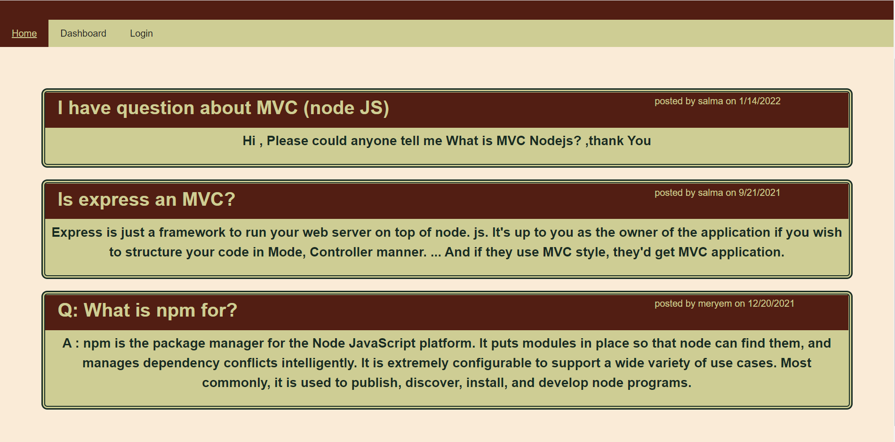
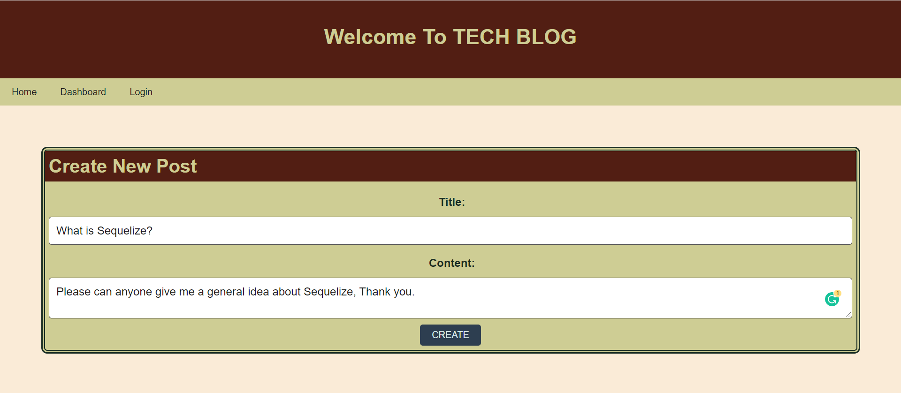
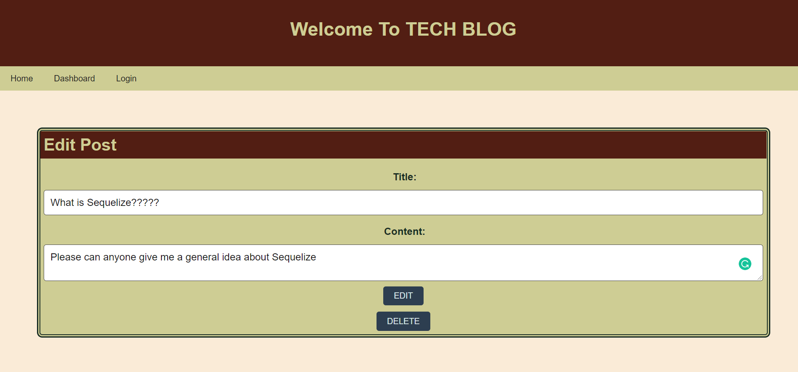

# Tech-Blog

  ## Description:
The Application requires to build a CMS-style blog site similar to a Wordpress site, where developers can publish their blog posts and comment on other developers’ posts as well. using Express.js API, javascript ,mysql , sequelize node-js handlebars-js, heroku-deployment

  ## User Story

```md
AS A developer who writes about tech
I WANT a CMS-style blog site
SO THAT I can publish articles, blog posts, and my thoughts and opinions
```

  ## Table of Contents 
  - [Installation](#installation)
  - [Usage](#usage)
  - [License](#license)
  - [ScreenShot](#screenShot)
  - [Links](#links)
  - [Questions](#questions)
  - [Copyright](#copyright)
  ## Installation
  to install dependencies , run this following command :
``` 
 npm i
 ```
  ## Usage
The User needs to clone first the repo then install dependencies by runing the following command :


1. Go to the database directory to connect :

 ``` 
cd .\db\
 ```

2. connect to the database :

 ``` 
mysql -uroot -p
 ```

3. Create database and tables  and exit fromd the DataBase:

  ``` 
1. source schema.sql;
2.  exit;

 ```
4.  run seeds :

  ``` 
 1. cd ..
 2. node seeds/index.js

 ```

5. run the server.js file
  ``` 
node server.js
 ```

  ## License
  this Project is licensed under **ISC** license.
  
  ## ScreenShot 

Home page:
   

authentification page:
   

 Comment interface :
   

Create new Post :
   


Edit/Delete interface :
   


  ## Links

  * Watch [the walkthrough video]() that demonstrates the functionality of the application.

  * The URL of the GitHub repository : https://github.com/MERYEM-AD/Tech-Blog

  *The URl of deployed application on heroku :
  
  ## Questions
  iF you have any questions about the repo you can contact me by email : adiri.meryem.mw@gmail.com.

  Follow me on [my Github account](https://github.com/MERYEM-AD).
  ## Copyright
 
```
Copyright 2021 , Meryem Adiri.

Permission to use, copy, modify, and/or distribute this software for any purpose with or without fee is hereby granted, provided that the above copyright notice and this permission notice appear in all copies.

THE SOFTWARE IS PROVIDED "AS IS" AND THE AUTHOR DISCLAIMS ALL WARRANTIES WITH REGARD TO THIS SOFTWARE INCLUDING ALL IMPLIED WARRANTIES OF MERCHANTABILITY AND FITNESS. IN NO EVENT SHALL THE AUTHOR BE LIABLE FOR ANY SPECIAL, DIRECT, INDIRECT, OR CONSEQUENTIAL DAMAGES OR ANY DAMAGES WHATSOEVER RESULTING FROM LOSS OF USE, DATA OR PROFITS, WHETHER IN AN ACTION OF CONTRACT, NEGLIGENCE OR OTHER TORTIOUS ACTION, ARISING OUT OF OR IN CONNECTION WITH THE USE OR PERFORMANCE OF THIS SOFTWARE.

```
